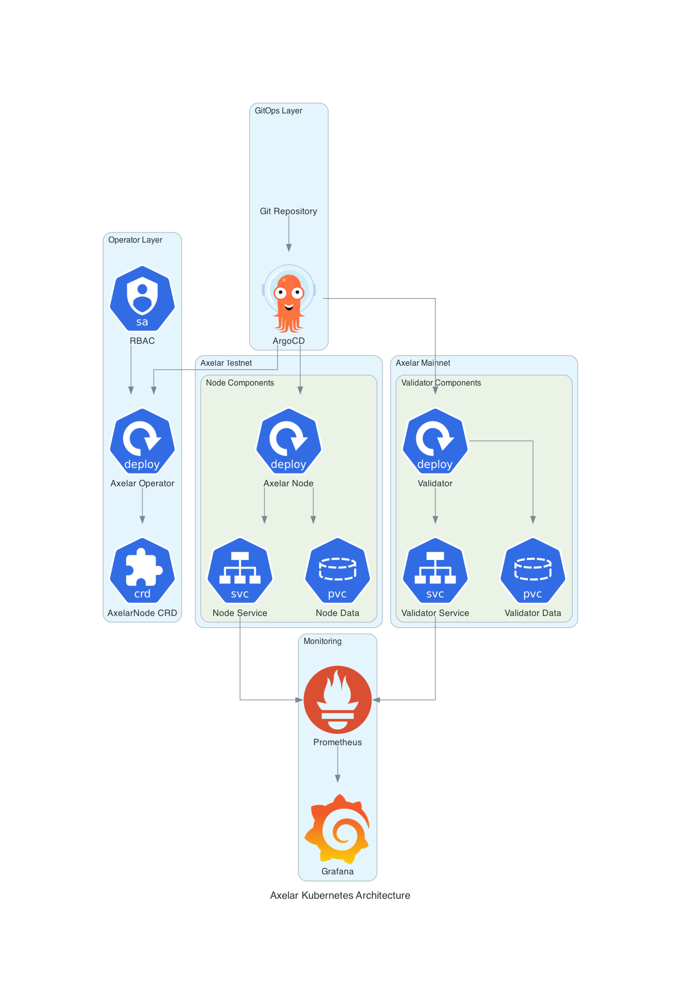

# Axelar Kubernetes Architecture

## Overview

This document provides a detailed architectural overview of the Axelar node and validator deployment on Kubernetes. The solution is designed following cloud-native principles and DevOps best practices.

## High-Level Architecture



## Components

### 1. Axelar Node

The Axelar node is the core component that:
- Synchronizes with the Axelar blockchain network
- Serves RPC and API requests
- Maintains blockchain state and data
- Provides Prometheus metrics for monitoring

**Key Features:**
- **Stateful**: Requires persistent storage for blockchain data
- **Network Connectivity**: Needs P2P connections to other nodes
- **Resource Requirements**: Moderate CPU and memory usage
- **Monitoring**: Exposes metrics on port 26660

### 2. Axelar Validator (Optional)

The validator extends the node functionality with:
- **Block Validation**: Participates in consensus mechanism
- **Cross-chain Operations**: Handles inter-blockchain transactions
- **Threshold Signatures**: Uses multi-party computation for security

**Additional Components:**
- **vald**: Validator daemon for cross-chain operations
- **tofnd**: Threshold signature daemon for MPC operations

### 3. Storage Architecture

```
Persistent Volumes:
├── Node Data (500Gi)
│   ├── config/           # Configuration files
│   ├── data/            # Blockchain data
│   └── keyring-file/    # Key storage
├── Validator Data (500Gi)
│   ├── config/          # Validator configuration
│   ├── data/           # Validator blockchain data
│   └── keyring-file/   # Validator keys
├── Tofnd Data (10Gi)
│   └── .tofnd/         # Threshold signature data
└── Shared Data (10Gi)
    ├── genesis.json    # Network genesis
    ├── seeds.txt       # Network seeds
    └── scripts/        # Initialization scripts
```

### 4. Network Architecture

```
External Traffic Flow:
Internet → Ingress → Service → Pod

Internal Traffic Flow:
Pod ↔ ConfigMap (Configuration)
Pod ↔ Secret (Credentials)
Pod ↔ PVC (Persistent Data)

P2P Network:
Node ↔ Axelar Network Peers (Port 26656)
```

### 5. Security Model

**Container Security:**
- Non-root user execution (UID 1000, GID 1001)
- Read-only root filesystem where possible
- Dropped capabilities (ALL)
- Security contexts enforced

**Secret Management:**
- Kubernetes secrets for sensitive data
- Base64 encoding for passwords and keys
- Separate secrets for node vs validator

**Network Security:**
- Network policies (optional)
- Service mesh integration ready
- TLS termination at ingress

## Deployment Patterns

### 1. Single Node Deployment

```yaml
Namespace: axelar-testnet
├── ConfigMap: axelar-config
├── Secret: axelar-secrets
├── PVC: axelar-node-data
├── Service: axelar-node-service
└── Deployment: axelar-node (1 replica)
```

### 2. Validator Deployment

```yaml
Namespace: axelar-testnet
├── ConfigMap: axelar-config
├── Secret: axelar-validator-secrets
├── PVC: axelar-validator-data
├── PVC: axelar-tofnd-data
├── PVC: axelar-validator-shared-data
├── Service: axelar-validator-service
└── Deployment: axelar-validator
    ├── Container: axelar-validator
    ├── Container: vald
    └── Container: tofnd
```

### 3. Multi-Environment Support

```
Environments:
├── testnet/
│   ├── Chain ID: axelar-testnet-lisbon-3
│   ├── Resources: Standard
│   └── Monitoring: Basic
└── mainnet/
    ├── Chain ID: axelar-dojo-1
    ├── Resources: Production
    └── Monitoring: Enhanced
```

## Resource Requirements

### Node Requirements

| Component | CPU | Memory | Storage | Network |
|-----------|-----|--------|---------|---------|
| Axelar Node | 2-4 cores | 4-8 GB | 500 GB | 100 Mbps |

### Validator Requirements

| Component | CPU | Memory | Storage | Network |
|-----------|-----|--------|---------|---------|
| Axelar Validator | 4-8 cores | 8-16 GB | 500 GB | 100 Mbps |
| Vald | 1-2 cores | 2-4 GB | - | - |
| Tofnd | 0.5-1 core | 1-2 GB | 10 GB | - |

## Monitoring and Observability

### Metrics Collection

```
Prometheus Metrics:
├── tendermint_consensus_height
├── tendermint_p2p_peers
├── process_resident_memory_bytes
├── process_cpu_seconds_total
└── Custom Axelar metrics
```

### Health Checks

```yaml
Liveness Probe:
  httpGet:
    path: /health
    port: 26657
  initialDelaySeconds: 120
  periodSeconds: 30

Readiness Probe:
  httpGet:
    path: /status
    port: 26657
  initialDelaySeconds: 60
  periodSeconds: 10
```

### Logging

- **Format**: JSON for structured logging
- **Level**: Info (configurable)
- **Rotation**: Handled by Kubernetes
- **Aggregation**: Compatible with ELK, Fluentd, etc.

## Scaling Considerations

### Horizontal Scaling

- **Nodes**: Can run multiple nodes for redundancy
- **Validators**: Typically single instance per validator identity
- **Load Balancing**: RPC/API traffic can be load balanced

### Vertical Scaling

- **CPU**: Scale based on network activity
- **Memory**: Scale based on state size
- **Storage**: Grows with blockchain history

## Disaster Recovery

### Backup Strategy

```
Critical Data:
├── Validator Keys (priv_validator_key.json)
├── Node Keys (node_key.json)
├── Mnemonics (validator.txt, tofnd.txt)
└── Configuration (app.toml, config.toml)

Blockchain Data:
├── Can be re-synced from network
├── Snapshots available for faster recovery
└── State sync for rapid bootstrap
```

### Recovery Procedures

1. **Key Recovery**: Restore from secure backup
2. **Data Recovery**: Re-sync or restore from snapshot
3. **Configuration Recovery**: Apply from version control
4. **Network Recovery**: Rejoin network with proper peers

## Performance Optimization

### Storage Optimization

- **SSD Storage**: Required for optimal performance
- **IOPS**: High IOPS storage for database operations
- **Pruning**: Configure pruning to manage disk usage

### Network Optimization

- **Peer Selection**: Optimize peer connections
- **Bandwidth**: Ensure sufficient bandwidth
- **Latency**: Minimize network latency

### Resource Optimization

- **CPU Affinity**: Pin to specific CPU cores
- **Memory**: Tune garbage collection
- **Caching**: Optimize application caches

## Security Best Practices

### Container Security

- Regular image updates
- Vulnerability scanning
- Minimal base images
- Non-root execution

### Kubernetes Security

- RBAC policies
- Network policies
- Pod security policies
- Secret encryption at rest

### Operational Security

- Key rotation procedures
- Access logging
- Audit trails
- Incident response plans

## Troubleshooting Guide

### Common Issues

1. **Sync Issues**: Check peer connections and network
2. **Storage Issues**: Monitor disk usage and IOPS
3. **Memory Issues**: Check for memory leaks
4. **Network Issues**: Verify P2P connectivity

### Diagnostic Commands

```bash
# Check pod status
kubectl get pods -n axelar-testnet

# View logs
kubectl logs -f deployment/axelar-node -n axelar-testnet

# Check metrics
kubectl port-forward svc/axelar-node-service 26660:26660 -n axelar-testnet
curl http://localhost:26660/metrics

# Check node status
kubectl port-forward svc/axelar-node-service 26657:26657 -n axelar-testnet
curl http://localhost:26657/status
```

## Future Enhancements

### Planned Features

- **Helm Charts**: Package as Helm charts for easier deployment
- **Operators**: Kubernetes operators for automated management
- **Service Mesh**: Istio integration for advanced networking
- **GitOps**: ArgoCD integration for GitOps workflows
- **Multi-cluster**: Support for multi-cluster deployments

### Monitoring Enhancements

- **Custom Dashboards**: Enhanced Grafana dashboards
- **Alerting Rules**: Comprehensive alerting rules
- **SLI/SLO**: Service level indicators and objectives
- **Distributed Tracing**: Jaeger integration for tracing
